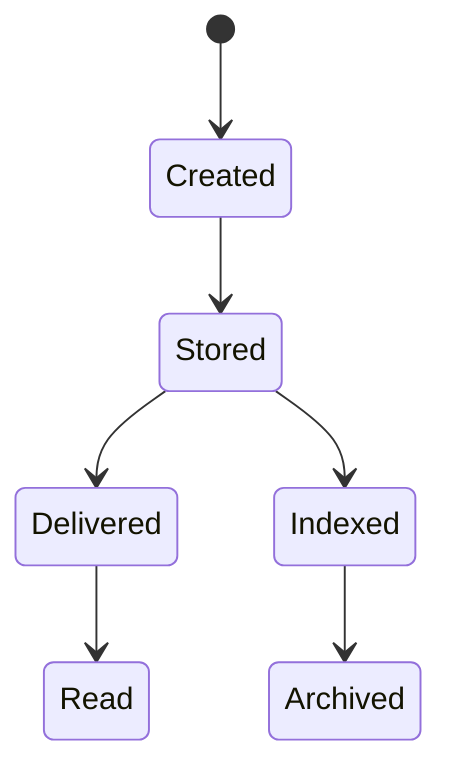

# Lab 1 : Variant 9 - Message Search & History

## Functional Requirements

1. A user can send messages to another user.
2. Each message has a lifecycle (sent / delivered / read).
3. The system must support:
    * search through message history by keywords;
    * pagination for historical data (loading messages in chunks).
4. The system must:
    * store messages and index them for search,
    * deliver updates asynchronously,
    * ensure high performance for search queries without affecting message delivery.
5. Recipients may be online or offline.
6. The system must ensure consistency between the primary database and the search index.

## Part 1 - Component Diagram

A **component diagram** that shows the system architecture, responsibilities, and interactions:
* system components,
* their responsibilities,
* interactions between them.

### Required components

* Client (Web / Mobile)
* Backend API
* Message Service
* Search Service
* Database (SQL)
* Search Index (NoSQL/Elasticsearch)
* Delivery mechanism (Queue / WebSocket / Push)


```mermaid
graph LR
  Client[Client] --> API[Backend API]
  API --> MS[Message Service]
  MS --> DB[(Primary SQL DB)]
  MS --> Queue{Message Queue}
  
  Queue --> Indexer[Indexer Service]
  Indexer --> SI[(Search Index)]
  
  API --> SS[Search Service]
  SS --> SI
  
  Queue --> DS[Delivery Service]
  DS --> Client

### Component responsibilities

* **Client** - displays message history and search results, sends pagination and search requests.
* **Backend API** - entry point for sending messages, retrieving history, and performing search.
* **Message Service** - stores and retrieves messages from the database.
* **Search Service** - processes search queries and retrieves results from the search index.
* **Database** - persistent storage of all messages.
* **Search Index** - optimized full-text index for fast keyword search.
* **Queue & Delivery Service** - asynchronously delivers messages to recipients.

---

## Part 2 - Sequence Diagram

### Scenario
User A searches for a keyword in a conversation history.

```mermaid
sequenceDiagram
  participant A as User A
  participant Client
  participant API
  participant Search as Search Service
  participant Index as Search Index
  participant DB

  A->>Client: Enter search keyword
  Client->>API: GET /conversations/{id}/search?q=keyword&cursor=123
  API->>Search: searchMessages(conversationId, keyword, cursor)
  Search->>Index: fullTextSearch()
  Index-->>Search: matched message IDs
  Search->>DB: fetch messages by IDs
  DB-->>Search: message records
  Search-->>API: paginated results
  API-->>Client: 200 OK (messages list)
```

### Explanation

1. The user submits a search query within a specific conversation.
2. The API forwards the request to the Search Service.
3. The Search Service performs a full-text search in the Search Index.
4. The Search Index returns matching message identifiers.
5. The system retrieves full message records from the Database.
6. Results are returned in paginated form.

---

## Part 3 - State Diagram

### Object: Message



### Notes

* **Created** - message object is constructed.
* **Stored** - message is persisted in the database.
* **Delivered** - message is delivered to recipient.
* **Read** - recipient has opened the message.
* **Indexed** - message content is added to the search index asynchronously.
* **Archived** - message is moved to long-term storage but remains searchable.

Indexing is performed asynchronously to avoid blocking message delivery.

---

## Part 4 - RFC (Request for Comments)

## RFC: Message Search and Pagination Strategy

### Context

The system must support searching through large message histories while maintaining high performance and scalability.

### Problem

Direct full-text queries on the primary relational database degrade performance as message volume grows. Offset-based pagination also becomes inefficient for large datasets.

### Proposed Solution

- Store all messages in the primary database.
- Use a separate full-text Search Index.
- Index messages asynchronously after persistence.
- Use cursor-based pagination for both history retrieval and search results.
- Filter results by conversationId and user permissions.

### Alternatives

- SQL LIKE queries on the primary database (rejected due to O(n) scanning).
- Offset-based pagination (rejected due to poor performance for large offsets).
- Client-side full history loading (rejected due to scalability limits).

### Consequences

+ Improved search performance  
+ Horizontal scalability  
+ Reduced load on primary database  
- Additional infrastructure complexity  
- Eventual consistency between database and index  

---

## Part 5 - ADR (Architecture Decision Record)

## ADR-003: Separate Search Index with Asynchronous Indexing

### Status
Accepted

### Decision

A dedicated full-text search index is introduced. Messages are first persisted in the primary database. After successful storage, an indexing event is published to the queue and processed asynchronously.

### Consequences

- High-performance keyword search.
- Clear separation between transactional storage and search optimization.
- Slight delay before new messages become searchable.
- Increased operational complexity.

---

## Design Rationale (Key Questions)

### Indexing Strategy

**Decision:** Use a dedicated inverted full-text index.

**Rationale:**

- Relational databases are optimized for transactional consistency, not full-text ranking.
- An inverted index maps terms to message identifiers, enabling sub-linear search complexity.
- Indexed fields include:
  - message content,
  - conversationId,
  - senderId,
  - timestamp.
- Filtering by conversationId ensures that search scope remains limited and efficient.

Asynchronous indexing prevents blocking the message write path and improves overall system throughput.

---

### Pagination Strategy

**Decision:** Use cursor-based pagination based on message timestamp or unique message identifier.

**Rationale:**

- Offset-based pagination requires scanning and skipping records (O(n)).
- Cursor-based pagination uses indexed fields, enabling O(log n) access.
- Prevents duplicate or missing records during concurrent writes.
- Ensures stable ordering by timestamp descending.

This approach improves performance for large conversations with millions of messages.

---

### Privacy and Consistency Trade-offs

**Privacy Considerations:**

- Search queries must be scoped by conversationId.
- Access control is enforced at the Search Service layer.
- Only messages accessible to the requesting user are returned.
- The search index does not bypass authorization rules.

**Consistency Considerations:**

- Indexing is asynchronous, leading to eventual consistency.
- A newly stored message may not immediately appear in search results.
- This trade-off improves write performance and scalability.

**Trade-off Summary:**

+ Higher performance and scalability  
+ Secure access control filtering  
- Small delay before search index reflects new messages  

---

## Conclusion

The designed architecture separates transactional storage from search optimization.  
It ensures scalable full-text search, efficient pagination, secure data access, and controlled consistency trade-offs.

The system is optimized for large-scale message history retrieval while maintaining architectural clarity and performance efficiency.

